# OpenVR-Plugin-with-Unity-2019.4-LTS

## Setup

### Contents:
1. Download Unity 2019.4 LTS
2. Download unity-xr-plugin
3. Start a new Unity Project
4. Setup Unity to use OpenVR Unity XR Plugin

5. Import SteamVR (Asset Store / Package Manager)
6. Add Simple VR Rig to Sample URP Scene

---

## 1. Download Unity 2019.4 LTS

1. Use `2019.4.8f1`

    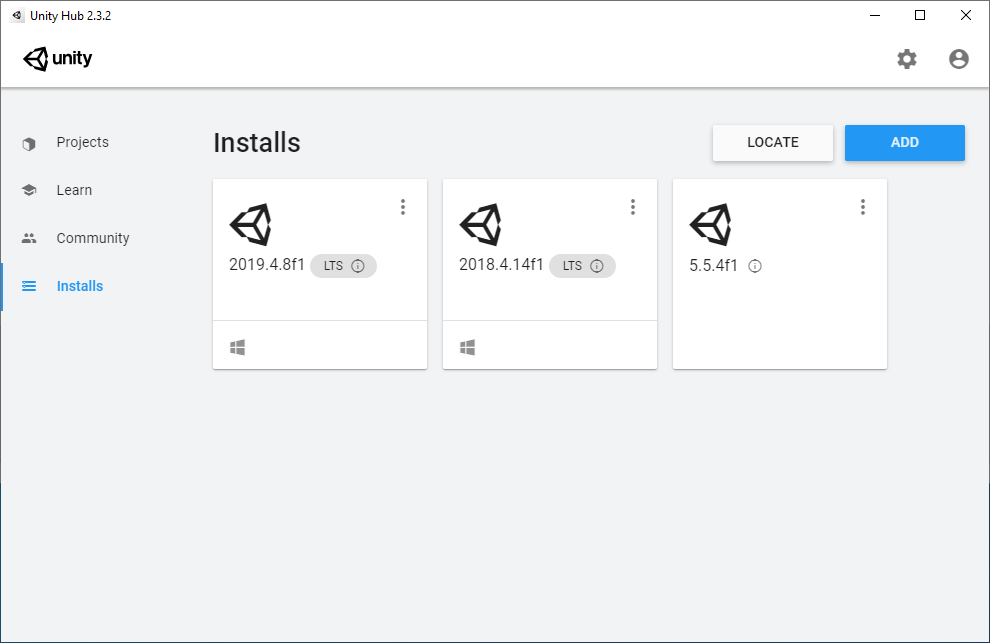

---

## 2. Download unity-xr-plugin
1. Go to: https://github.com/ValveSoftware/unity-xr-plugin/releases
2. Download: OpenVR-XR-Plugin-Installer.unitypackage

    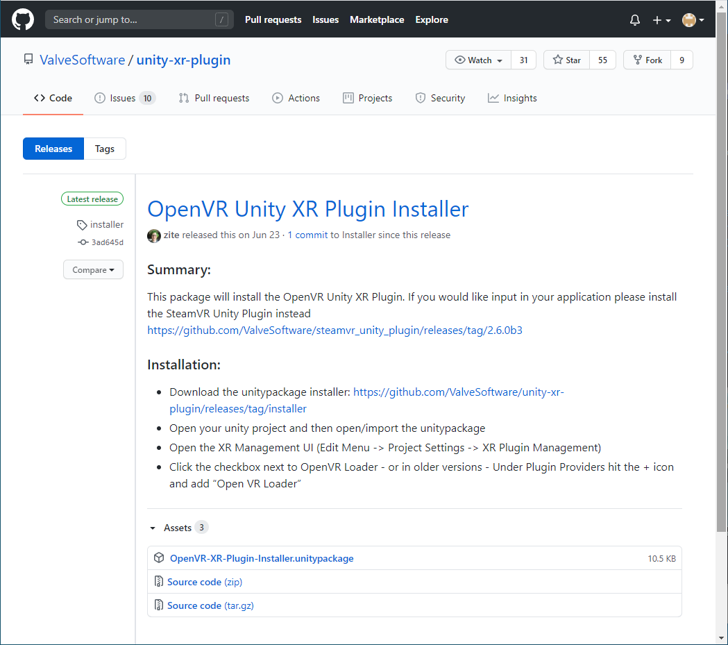

---

## 3. Start a new Unity Project

1. Select the `Universal Render Pipeline` (URP) Template.
2. Choose your prefered location on your hard drive.
3. Give your project a name.

   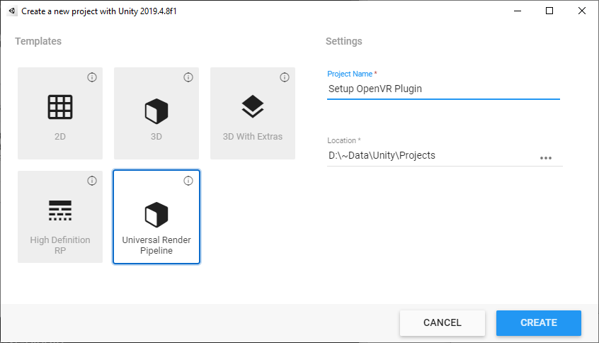

---

## 4. Setup Unity to use OpenVR Unity XR Plugin

1. Drag the `OpenVR-XR-Plugin-Installer.unitypackage` file that you downloaded in Step 2 and drop it into your project window.

2. When the `Import Unity Package` Window pops up, simply click the `Import` Button.

    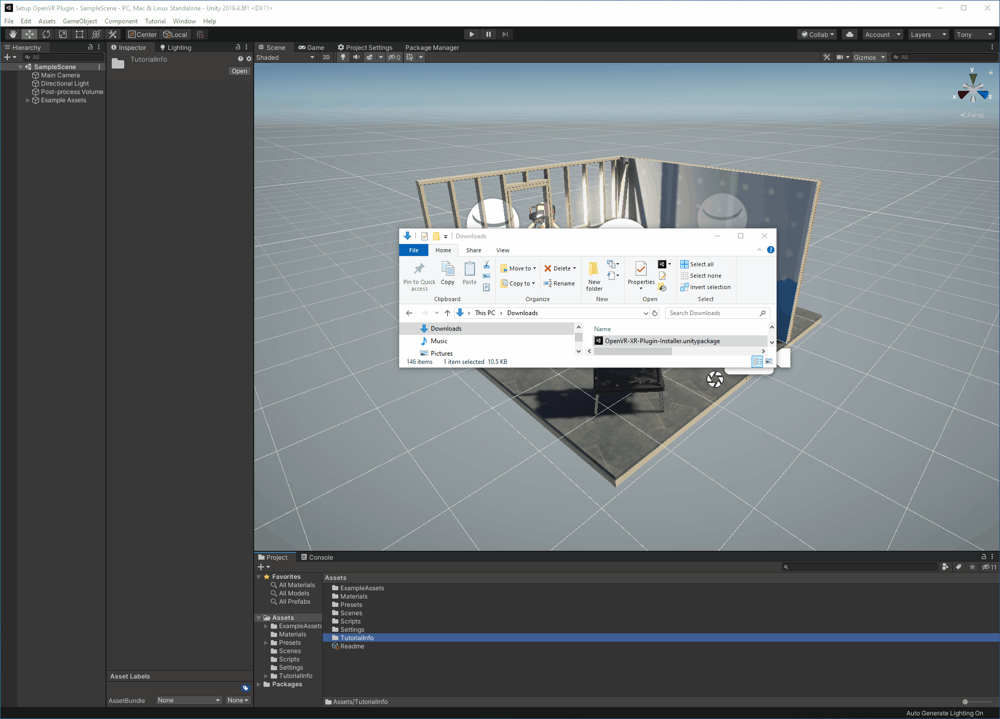

3. After the installation finishes, the OpenVR XR Plugin will appear in your `Packages` Folder.

    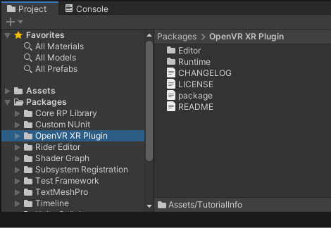

4. Open up the Project Settings Window: `Edit > Project Settings`

5. In the `XR Plug-in Management` tab, ensure that both `Initialize XR on Startup` and `OpenVR Loader` are checked.

    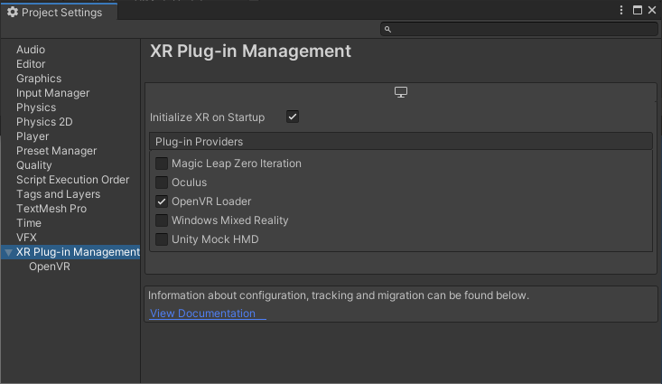

---

## 5. Import SteamVR (Asset Store / Package Manager)

1. Go to the Asset Store (https://assetstore.unity.com/)

2. Find SteamVR (https://assetstore.unity.com/packages/tools/integration/steamvr-plugin-32647)

3. Add SteamVR to your assets.

4. Open the Package Manager in Unity.

5. Switch to `My Assets` and search for `Steam`

6. Download / Import `SteamVR Plugin 2.6.1 (sdk 1.13.10)`

    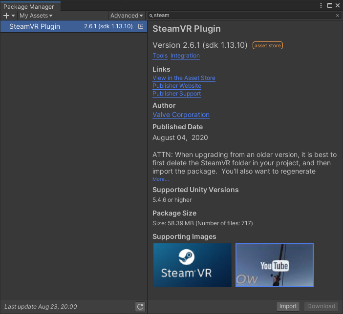

7. Check all items and `Import`

    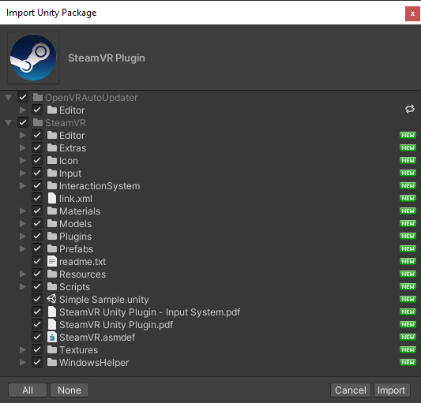

8. On `Built in VR Detected` Window, choose `OK` to remove `Oculus Desktop` and `OpenVR Desktop`

    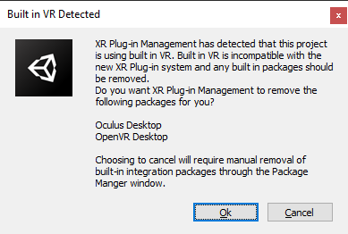

9. On the 2nd `Built in VR Detected` Window, choose `OK`

    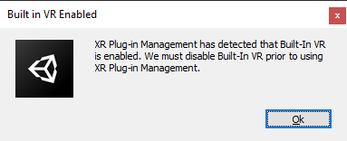

10. Click `OK` in the `OpenVR Unity XR successfully updated` Window

    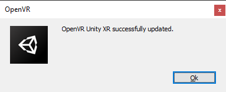

11. In the `Valve.VR.SteamVR_UnitySettingsWindow` Window, click on the `Accept All` Button

    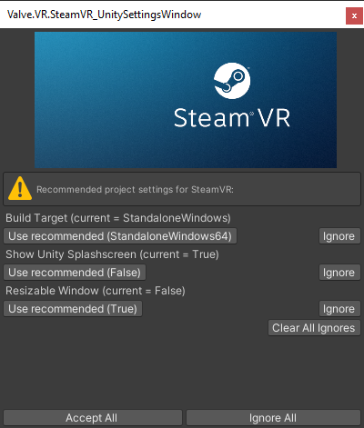

12. Click `OK` in the `You made the right choice!` Window

    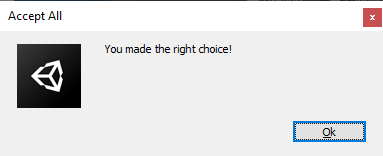

13. Upgrade the SteamVR Materials (Edit > Render Pipeline > Universal Render Pipeline > Upgrade Project Materials to UniversalRP Materials)

    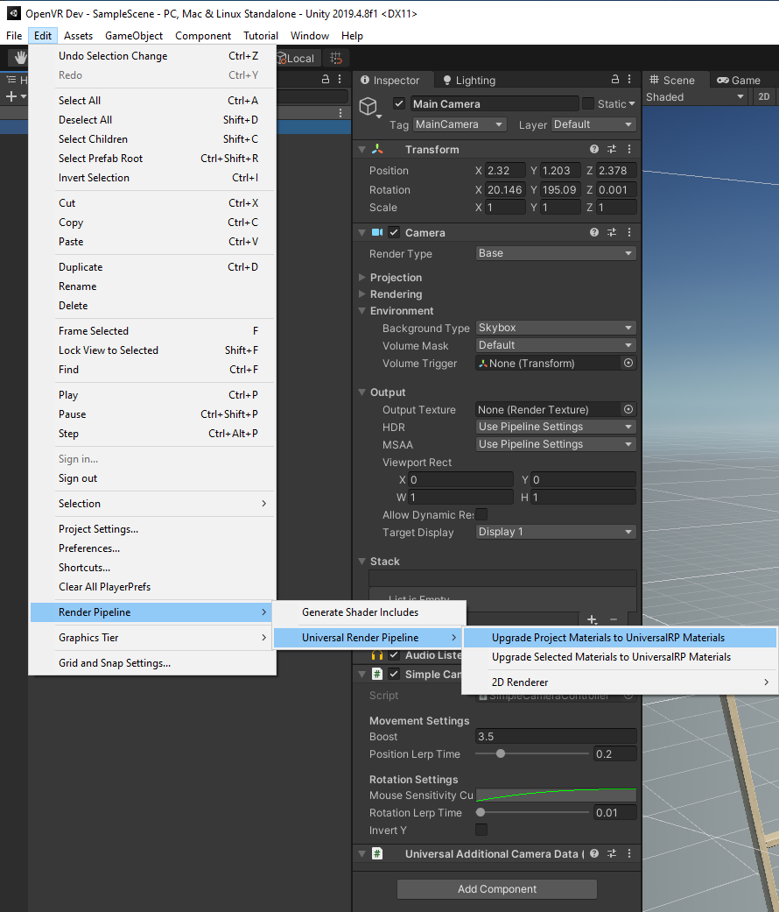

14. Select `Proceed` in the `Material Upgrader` Window

    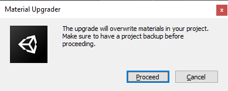

15. Done.

    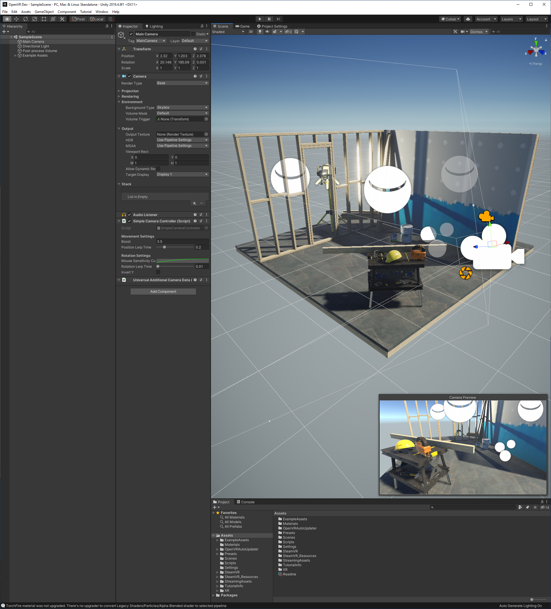

---

## 6. Add Simple VR Rig to Sample URP Scene

1. Start by Deleting the `Main Camera` from the `SampleScene`

    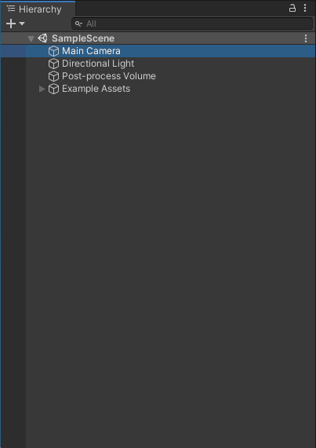

2. Find the `Player` prefab in `SteamVR > InteractionSystem > Core > Prefabs > Player` and drag it into the SampleScene.

    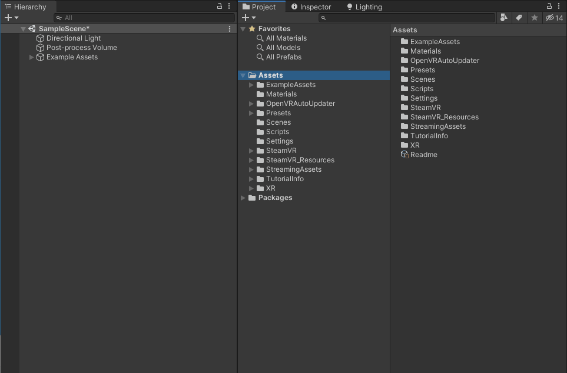

3. Click on the Play Button.

4. When the `[SteamVR]` window pops up asking about generated actions for SteamVR Input, go ahead and click on `Yes`

    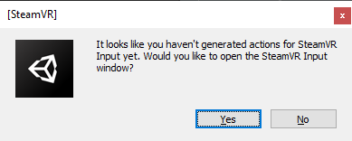

5. When the `Copy Examples` window pops up , go ahead and click on `Yes`

    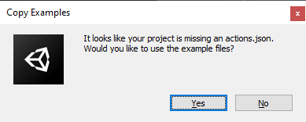

6. In the `SteamVR Input` Window, simply click on the `Save and generate` Button.

    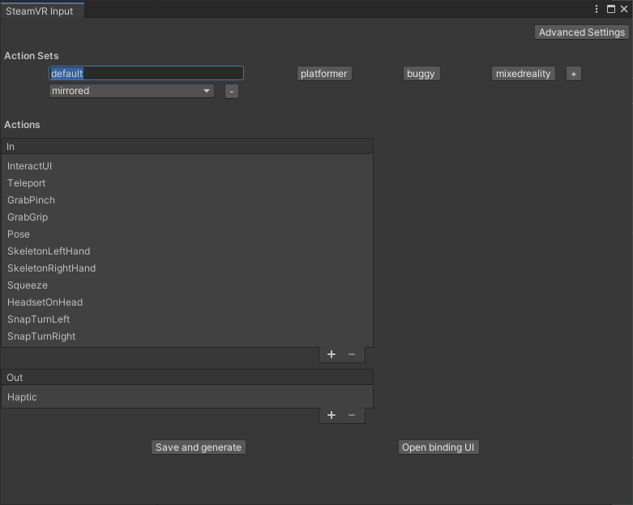

7. In the `Scene(s) Have Been Modified` Window, click on the `Save` Button.

    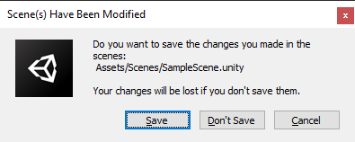

8. Go ahead and close the `SteamVR Input` Window

9. Click on the Play Button, strap on your Head-Mounted Display, pick up your controllers and enjoy!